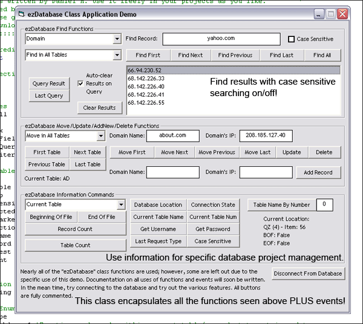

## ezDatabase ADO Class Updated\! \(30\+ Functions\!\)

### Description

This class makes VB Database Applications easy to write on the fly! This class includes over 30 functions for ADODB programming in VB! It encapsulates all the Find Functions, Move Functions, along with AddNew, Delete, Update functions and a ton of error trapping for easy use! Also includes events to program at your disposal! Please leave comments/feedback and vote if you'd like. This is my first class file I have been working on.
 
### More Info
 

             |
---                |---
**Submitted On**   |2005-02-09 21:38:00
**By**             |[Daniel M](https://github.com/Planet-Source-Code/PSCIndex/blob/master/ByAuthor/daniel-m.md)
**Level**          |Intermediate
**User Rating**    |4.8 (19 globes from 4 users)
**Compatibility**  |VB 6\.0
**Category**       |[Databases/ Data Access/ DAO/ ADO](https://github.com/Planet-Source-Code/PSCIndex/blob/master/ByCategory/databases-data-access-dao-ado__1-6.md)
**World**          |[Visual Basic](https://github.com/Planet-Source-Code/PSCIndex/blob/master/ByWorld/visual-basic.md)
**Archive File**   |[ezDatabase1850892102005\.zip](https://github.com/Planet-Source-Code/daniel-m-ezdatabase-ado-class-updated-30-functions__1-58814/archive/master.zip)

